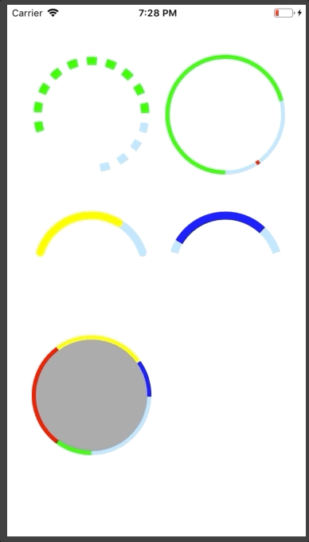

# INCircleView - lightweight component for drawing progress or indicator circles.

This is a swift rewrite of a component in Objective C that I wrote several years ago. It is intended to be used as a lightweight customisable circle progress or indicator view. To make it easy to setup most of the parameters can be setup in the Interface Builder and the values are 0 to 1 so the progress values returned from other parts of the app can be passed directly without having to worry about converting to angles.




## Installation
### Requirements
iOS 10.0+

### Cocoapods
To install through [CocoaPods](http://cocoapods.org) add this to your podfile:

```ruby
pod 'INCircleView'
```

### Manual
Just add INCircleView.swift located in the `INCircleView` folder to your project and you're good to go.

## Usage
### Setup
See the sample project for usage examples. 

To start with a simple circle just add a UIView in Interface Builder and set its class to INCircleView. Connect it to an IBOutlet in your UIViewController and call the following function to set an equal number of fill colours and fill values. That's it. If there are multiple differently coloured sections you can set as many colour and fill value pairs as needed.
```
circleView.set(fillColors: [.green], fillValues: [0.5])
```
After the initial setup you can update the fill values by just passing the new fill values in. Make sure that the number of fillColors originally set match the number of values passed here.
```
circleView.update(fillValues: [0.6])
```
### Parameters
All of the parameters except for the lineDashPattern can be configured in the Interface Builder in addition to setting them in code. See individual parameter descriptions for more details.
```
startValue
```
Set this if you don't want a full 360 circle. For example a circle that would start at half of the way would have this value at 0.5. The fill values are adjusted to take this into account so passing a fill value of 0.5 to a circle starting at 0.5 and ending at 1 will fill it up to 0.75 to show the semicircle as half filled.
```
endValue
```
Set this if you don't want a full 360 circle. See start startValue above for more details.
```
capLocation
```
A cap is an indicator that can be placed anywhere on the circle. It stays  on top of the other fill layers. Can be used to show a maximum value or maybe indicate a difference between differently coloured sections of the circle.
```
capLocation
```
The start point of the cap indicator.
```
capSize
```
The size of the cap indicator.
```
fillOffset
```
This is the offset of the fill values. It can be used if the fill is not to start at the beginning of the circle.
```
emptyColor
```
Empty circle background colour.
```
capColor
```
Cap indicator colour.
```
emptyBackgroundColor
```
Colour of the circle inside background. 
```
lineWidth
```
Width of the circle line.
```
radius
```
Radius of the circle. By default it matches half the size of the view so the circle fits into its frame. Note that this is based on the width so the view should be square.
```
isClockwise
```
Sets the direction of the circle fill.
```
roundedCorners
```
Sets the circle fills to have rounded corners
```
dashNumber
```
Seting the dash number updates the lineDashPattern to show the set number of visible segments. There is an issue to be addressed where this starts to lose accuracy at bigge widths and many segments.
```
lineDashPattern
```
Set the pattern for filled/empty spaces in the circle.

## License
MIT license. See the LICENSE file for more info.
